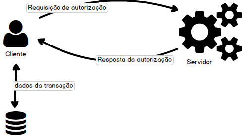
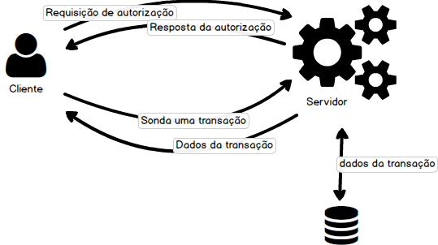

# Financial transactions

The project consists in the implementation of two applications (client and server) that can **simulate the process of a financial transaction**

### Client application / Frontend (you can give it a cool name, or not :D)

It should be a simple application (without any business logic) using the technology that you prefer. You don't need to implement the state of the art in terms of UI/UX just something to interact to the server.

Requirements:

* **Transaction screen**: Transaction data input and sending it to the server
* **Transaction history screen**: Transactions history

#### Virtual credit card catalog

Create a virtual credit card catalog (1 or 2 card its ok) that will be available when the client does a purchase. The cards should have more properties than the "normal" card described bellow.

* The key/password of each card should be cryptographed in somehow. 
* With the catalog, the key/password validation should be on the server side.

### Server / Backend

The server should simulate an official financial transaction.

    In the real world, a financial transaction is a communication between the bank and the provider (Visa, Mastercard, etc). The server doesnt need to worry about it just to simulate it as close as we can get to this.

**Return codes**

Code | Explanation
--- | ---
Approved | Transaction approved
Denied | Transaction denied
Insuficient funds | Insuficient funds
Invalid value | Minimun of 10 cents
Blocked card | When the card is blocked
Invalid password size | Password should be between 4 and 6 digits
Invalid password | Password is invalid

This are only example return codes, feel free to add new ones when needed.

### Client registration

The application should be able to register clients so that transaction can occur. The credit limit of each client should be considered.

### Client server communication

Communication should be through HTTP (REST).

#### Authorization

#### Tracking of transactions

## Data model

The described data model can, and should, be improved and increased.

### Card

Property | Description
--- | ---
CardholderName | Card holder name
Number | Card number that can vary from 12 to 18 chars
ExpirationDate | Card expiration date
CardBrand | Brand provider of the card (VISA, etc)
Password | Card password/pin
Type | Card type (chip or band)
HasPassword | If the card has password. Only band cards can have this property set to `True`.

### Transaction

Property | Description
--- | ---
Amount | Transaction value
Type | Transaction type
Card | Card properties
Number | Transaction numer (for when the transaction is divided in multiple ones)

### The purspose of the exercice

1. Design & Architecture of the solution
2. Get familiared with the .NET environment
3. Project patterns
4. Organization, documentation and code legibility
5. Dont reinvent the wheel
6. Testing strategies
7. Unit test
8. Data modeling 
